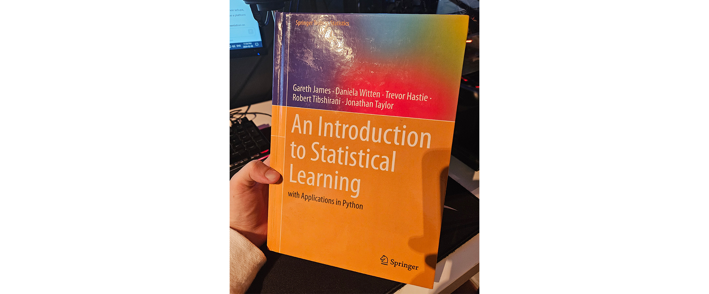
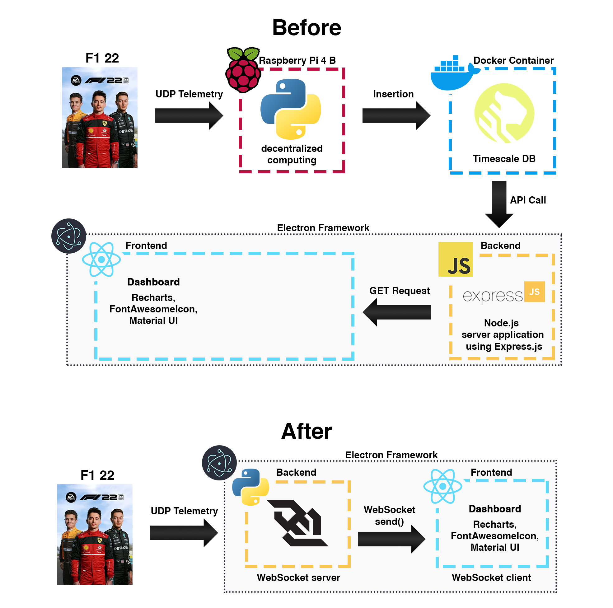

# Updates and Progress

## Initial Set-Up: Database and UDP Ingestion
##### _December 21, 2023_

First, I needed to find a way to obtain the telemetry from the game. I found some very useful [documentation](https://f1-2019-telemetry.readthedocs.io/en/latest/telemetry-specification.html) on the F1 game telemetry to start off the project. The game delivers a constant stream of telemetry data via UDP, ranging from approximately 20,000 to 150,000 data points per second, depending on the configuration settings you choose. 

I decided to use a **Raspberry Pi** that I had laying around to receive the data, the **Python** scripts that run on the Pi can be found in the *telemetry* folder.

| File name | Description |
| ------ | ------ |
| main.py | Orchestrates the overall process, coordinating data collection from listener.py and handling data insertion using db_handler.py |
| db_handler.py | Manages database connectivity and contains functions for inserting data into the database. |
| listener.py | Listens for and captures telemetry data from the F1 game via UDP packets. |
| f1_2019_struct | All of that code was obtained in the aforementioned documentation. |

For the database, I decided to use a **TimeScale** database, which is an extension of PostgreSQL, because it is designed specifically for handling time-series data efficiently. I run it on a **Docker** container on my computer, since I have a lot more storage space than on the Pi. We can find the SQL scripts to create the different tables and some .csv files in the folder *database*.

Here is a diagram of the set-up so far:

## Creation of the App
##### _December 29, 2023_
I have now created the app where everything will happen. The app uses the *Electron Framework* to allow me to use *React* (*TypeScript*) to make a nice and interactive frontend. There is a Node.js server application using Express.js as the backend to fetch the data from the database. For now, I only developed the "Dashboard" section of the app that displays some of the data we ingest from the game. It refreshes automatically with the data from the *TimescaleDB* database. I programmed different ways to display different kinds of data, some have line graphs, some have diagrams of an F1 car and others. The interface is easy to use, smooth, and intuitive. There is even a feature to customize your "Home" tab on the dashboard to choose the components you want to see. In the future, I will program the "Analytics" section where I will do some real-time and post-race analysis of the data, and a "Settings" section to let the user customize their experience. Below, a quick walk-around of the app is shown to display the general feel of the app.

Here is an updated diagram of the project so far.

## Study Time: Basics of Data Analysis
##### _February 8, 2024_
The month of January was hectic for me. With school picking back up, my software engineering internship, and implications in clubs/associations, this project's progress slowed down greatly. This project is now something I will only do in my free time. During the month of January, I have decided to study the basics of data analysis. I bought a textbook about it (as shown below) that was greatly recommended on the internet and read it from cover to cover. I also watched multiple videos about it online and completed a small beginner-level guided-project on cognitive class. The next step for this project will be to implement some data analysis elements as I think it is a very interesting field and I think that this project is a great learning opportunity for that.

I'm ready to start pushing the boundaries of my knowledge in this project. Things will only get more interesting from here.

## Development: Tyre Strategy Analysis Tools
##### _March 22, 2024_
Alright. I've had very little free time but I've finally managed to finish the first feature in the Analysis tab.
This tool let's you choose some settings of a Grand Prix you want to simulate, and it tells you the best tyre/pit stop strategy for that race.
This was a fantastic way to learn **data analysis** and **advanced data visualization**. All the models were made with **linear regression** and **cross-validation**. Although, I have experimented with **CatBoost** models and even **RandomForestRegressor**.

Three models have been made to make this possible:
| Model | Description |
| ------ | ------ |
| Fuel Left | This model is used to determine how much fuel is left in the car at any given time. This is relevant as the car gets faster the lighter it gets. |
| Tyre Wear | This model is used to determine how worn out the tyres are. This is very important because not only does tyre wear affects lap time, we also need this information to know when we need to change them. |
| Lap Time | This model is the big one, the two previous models are fed into this one, alongside other features, to simulate a lap time. |

All of these models are used iteratively to simulate entire races. 

## Development: Real-time Data Ingestion Modification and UI Enhancements
##### _April 10, 2024_
In the past couple of weeks, I have changed the way I ingest data into my app. As shown in the diagram below, the data was ingested by a Python server on a Raspberry Pi, sent to a database on a Docker container, and then was queried over with a GET request. I decided to cut out the middleman so that users don't have to create a database to use my app. I opted for a Python **WebSocket** server that would directly send the data to the **React Front-end**, saving only the necessary data.

The initial version of the data ingestion structure may seem inefficient, but I needed to be able to store data to build the machine learning models for the analysis tab. Now that I have a satisfactory amount of data, the new structure with the WebSocket server/client offers a much simpler, and more efficient way to ingest the data into my app. The data is now displayed instantly, with great precision.

Another thing that I worked on was many UI improvements. I introduced a dark mode, it is now possible to modify the component size in the home tab of the dashboard, and many more aesthetic improvements.

Here is a quick showcase of the new look of the dashboard and the different improvements I have made:

