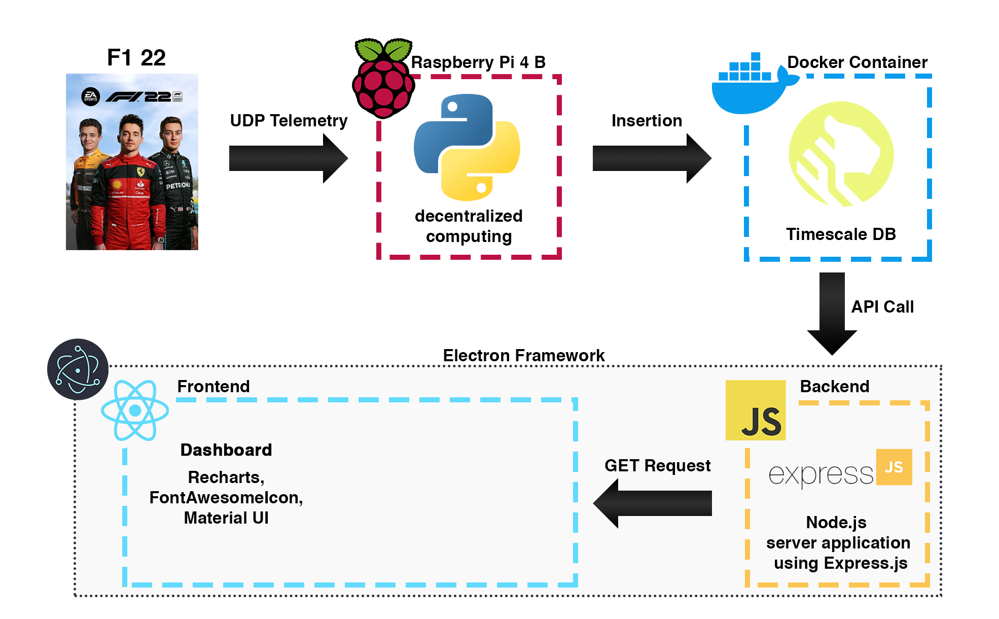

# Updates and Progress

## Initial Set-Up: Database and UDP Ingestion
##### _December 21, 2023_

First, I needed to find a way to obtain the telemetry from the game. I found some very useful [documentation](https://f1-2019-telemetry.readthedocs.io/en/latest/telemetry-specification.html) on the F1 game telemetry to start off the project. The game delivers a constant stream of telemetry data via UDP, ranging from approximately 20,000 to 150,000 data points per second, depending on the configuration settings you choose. 

I decided to use a **Raspberry Pi** that I had laying around to receive the data, the **Python** scripts that run on the Pi can be found in the *telemetry* folder.

| File name | Description |
| ------ | ------ |
| main.py | Orchestrates the overall process, coordinating data collection from listener.py and handling data insertion using db_handler.py |
| db_handler.py | Manages database connectivity and contains functions for inserting data into the database. |
| listener.py | Listens for and captures telemetry data from the F1 game via UDP packets. |
| f1_2019_struct | All of that code was obtained in the aforementioned documentation. |

For the database, I decided to use a **TimeScale** database, which is an extension of PostgreSQL, because it is designed specifically for handling time-series data efficiently. I run it on a **Docker** container on my computer, since I have a lot more storage space than on the Pi. We can find the SQL scripts to create the different tables and some .csv files in the folder *database*.

Here is a diagram of the set-up so far:

## Creation of the App
##### _December 29, 2023_
I have now created the app where everything will happen. The app uses the *Electron Framework* to allow me to use *React* (*TypeScript*) to make a nice and interactive frontend. There is a Node.js server application using Express.js as the backend to fetch the data from the database. For now, I only developed the "Dashboard" section of the app that displays some of the data we ingest from the game. It refreshes automatically with the data from the *TimescaleDB* database. I programmed different ways to display different kinds of data, some have line graphs, some have diagrams of an F1 car and others. The interface is easy to use, smooth, and intuitive. There is even a feature to customize your "Home" tab on the dashboard to choose the components you want to see. In the future, I will program the "Analytics" section where I will do some real-time and post-race analysis of the data, and a "Settings" section to let the user customize their experience. Below, a quick walk-around of the app is shown to display the general feel of the app.

Here is an updated diagram of the project so far.

